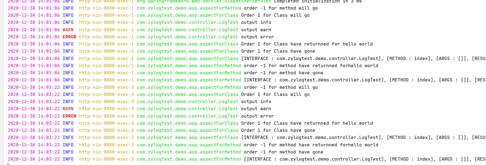
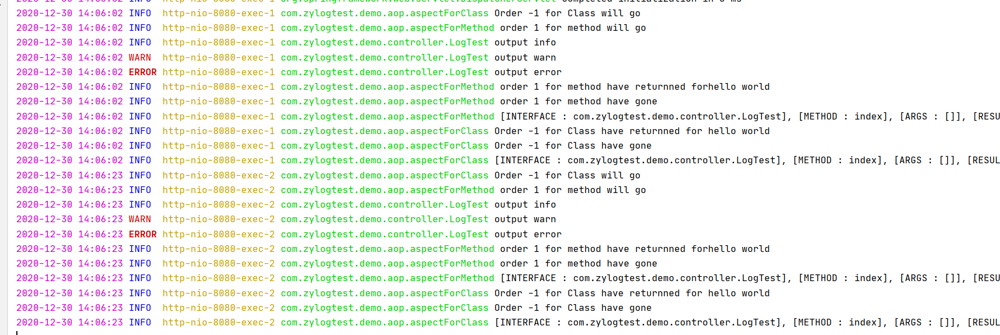

# @Slf4j+@Order
#log日志框架使用
* 添加lombok插件直接使用 @Slf4j注解 来使用log
* 添加配置文件，设置日志详情
* 基于类/方法取决于切面表达式

## 切面表达式  
* execution 方法切点 匹配
* @annotation() 方法注解 匹配
* args()  方法参数（入参对象） 匹配
* @args() 方法参数所用注解（修饰入参对象的注解） 匹配 
* within() 目标类、目标注解修饰类 匹配 
 ```java
within(com.example.demo.interceptor.*) interceptor包下所有类方法执行都会进切面

within(@com.example.demo.interceptor.TestAno *) 标有TestAno注解的类下的方法执行时都会经过切面
```
* @within() 目标注解修饰类 匹配 参数注解全限定类名
* target() 具体类名及其实现类 匹配 参数全限定类名
* @target()  目标注解修饰类 匹配
* this() 代理类按类型匹配于指定类  （类似于target()）参数全限定类名 

## 切面表达式参数
```java
execution(modifiers-pattern? ret-type-pattern declaring-type-pattern?name-pattern(param-pattern) throws-pattern?)
```
* modifiers-pattern：方法的可见性
* ret-type-pattern：方法的返回值类型
* declaring-type-pattern：方法所在类的全路径名，
* name-pattern：方法名类型，
* param-pattern：方法的参数类型，
* throws-pattern：方法抛出的异常类型
* *通配符，该通配符主要用于匹配单个单词，或者是以某个词为前缀或后缀的单词。
* ..通配符，该通配符表示0个或多个项，主要用于declaring-type-pattern和param-pattern中，

#@Order注解

* 执行结果如图

* 修改后执行结果



